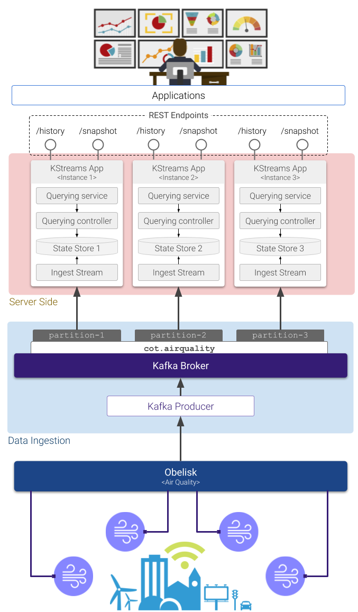

# EXPLORA Kafka

This is a Kafka Streams implementation of the [EXPLORA framework](https://www.mdpi.com/1424-8220/20/9/2737).

## Features

* Continuous computation of data summaries, as new data becomes available in [`Obelisk`](https://obelisk.ilabt.imec.be/api/v2/docs/) (Stream processors consume sensor readings from a Kafka topic).

* Three geo-indexing methods: Geohash, Quad-tiles and Slippy tiles (default: quad-tiles).

* Configurable resolution of the spatial fragmentation scheme (default: 14). Multiple resolutions can be specified.

* Data summaries are computed on a custom set of air quality variables supported by Obelisk (default: `airquality.no2::number,airquality.pm10::number`)

## Architecture



## Requirements

* A Kafka topic where the sensor observations from `Obelisk` are being posted. To get data from Obelisk into a Kafka topic you could use [`cot-see-consumer`](https://gitlab.ilabt.imec.be/lordezan/cot-sse-consumer), which is an implementation of a client of the Server-Sent Events endpoint from `Obelisk`.


## Running the server

Use the commands below to run one instance of the server on localhost:7070

``` 
$ docker build -t explora-kafka .

$ docker run --name explora \
    --network="host" \  
	-e METRICS="airquality.no2::number,airquality.pm10::number" \
	-e READINGS_TOPIC="<topic_name>" \
	-e APP_NAME="explora-ingestion" \
	-e KBROKERS="<kafka_host>:<kafka_port>" \
	-e GEO_INDEX="quadtiling" \
	-e PRECISION='14' \
	-e REST_ENDPOINT_HOSTNAME="0.0.0.0" \
	-e REST_ENDPOINT_PORT="7070" \
	explora-kafka
```

## REST API

### Endpoint for `Historical-spatial queries`:

```
GET /airquality/{metric_id}/aggregate/{aggregate}/history
```

#### Path parameters:

* `metric_id`: (required) one of the air quality metrics available from the Bel-Air setup (`airquality.no2::number`|`airquality.pm10::number`|...).
* `aggregate`: (required) one of the available aggregate function (`avg`|`sum`|`count`).

#### Query parameters:

* `from`: the start of the query interval as a timestamp in milliseconds.
* `to`: the end of the query interval (exclusive) as a timestamp in milliseconds.
* `res`: `min`|`hour`|`day`|`month`.
* `gh_precision`: in case multiple continuous views corresponding to multiple values of precision have been computed, via this parameter it is possible to specify the desired precision for the query at hand (default: `14`)
* `geohashes`: (required) comma separated list of geohashes or quadtree prefixes composing a polygon, e.g.: `12020213023022,12020213023023,12020213023200,12020213023201,12020213023210`.
* `interval`: optionally it is possible to use one of five predefined intervals: `5min`|`1hour`|`1day`|`1week`|`1month`.

Example:

```
curl "http://localhost:7070/api/airquality/airquality.no2::number/aggregate/avg/history?from=1555632000000&to=1556236800000&gh_precision=14&res=min&geohashes=12020213023022,12020213023023,12020213023200,12020213023201,12020213023210,12020213022313,12020213023202,12020213023203,12020213023212,12020213022331,12020213023220,12020213023221,12020213023230,12020213023222,12020213023223"
```

### Endpoint for `Snapshot-temporal queries`:

```
GET /airquality/{metric_id}/aggregate/{aggregate}/snapshot
```

#### Path parameters:

* Same as the previous endpoint

#### Query parameters:

* `bbox`: (required) comma-separated string of coordinates corresponding to the bounding box over which the snapshot would be taken.
* `res`, `gh_precision`: same as for the previous endpoint.
* `ts`: timestamp in milliseconds corresponding to the instant the snapshot would be taken.

Example:

```
curl "http://localhost:7070/api/airquality/airquality.no2::number/aggregate/avg/snapshot?bbox=51.32,4.09,51.15,4.75&res=day&gh_precision=14&ts=1573167600000"
```

**Note:** *The platform is only able to provide answers on time intervals for which data has been ingested already, so, for instance, if you start ingesting data from 2020, it won't be able to process queries from previous years.*
